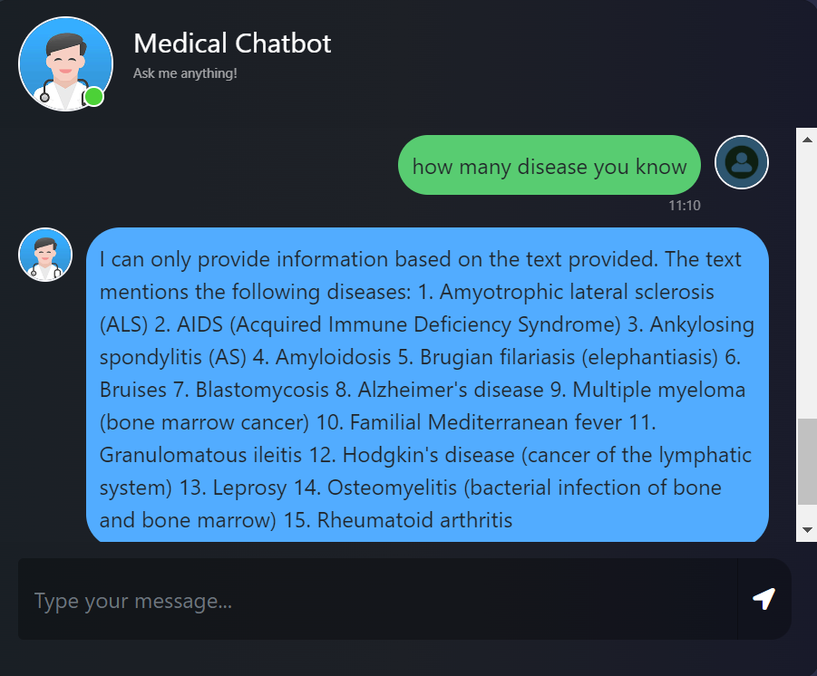

# Medical-ChatBot

Here is a model demonstrating its appearance:



This customized language model is designed to provide comprehensive medical information, akin to a more interactive and intellectually engaging version of Google. It offers thoughtful and detailed responses, drawing from a singular yet authoritative source: "The Gale Encyclopedia of Medicine" by Jacqueline L. Longe. While its knowledge base is limited to this esteemed publication, it ensures the information delivered is precise, reliable, and highly informative.

This is not available on the cloud. To view it, you need to run this repository on your local machine. Here's how you can do so.

# Features
- Well establsihed UI/UX.
- Easily modifiable.
- Easy set up.
- Ability to understand misspellings.
- Provide reliable and well-considered responses.

# Where you can use it
- Understanding disease details.
- As a General adviser.
- Addressing exam questions from the book.

# Instructions for Local Usage

1. Clone the repository.

    Or You can download it as zip file.

2. Navigate to the repo directory.
3. Open your git bash in the terminal of VS Code.
4. Create virtual environment using command:

    `conda create -p env python=3.8 --y`
4. Activate the virtual environment using command: 

    `source activate ./env` Or `conda activate ./env`

    Use whatever works for you.
5. Install all the requirements using command:

    `pip install -r requirements.txt`
5. Now, create the .env file to store the environment variables by running the following command in the bash shell:

    `touch .env`
6. Please open the file and insert the following variables along with their values. You can create your own keys quickly and easily using the link provided.

    [Create Pinecone API Key](https://app.pinecone.io/organizations/-O-_jTPCIEfAxwC57TBt/projects/5fe3244c-b6ce-4582-945a-913617f030ca/keys "Pinecone Database")

    [Create Groq API Key](https://console.groq.com/keys "Groq Model")

    ```
    PINECONE_API_KEY = "<put your pinecone_api_key>"
    PINECONE_API_ENV = "us-east-1-gcp"
    GROQ_API_KEY = "<put your groq_api_key>"
    ```
7. Then create the index with dimension 384 and everything else remains default.

    [name index to be "medical-chatbot"](https://app.pinecone.io/organizations/-O-_jTPCIEfAxwC57TBt/projects/5fe3244c-b6ce-4582-945a-913617f030ca/indexes " medial-chatbot")
7. Now run the command to use your chatbot.

    `python app.py`

# Contributions
We warmly welcome your contributions! Feel free to fork this repository, implement your amazing ideas, and submit a pull request. Join us in enhancing this project together!

    
    